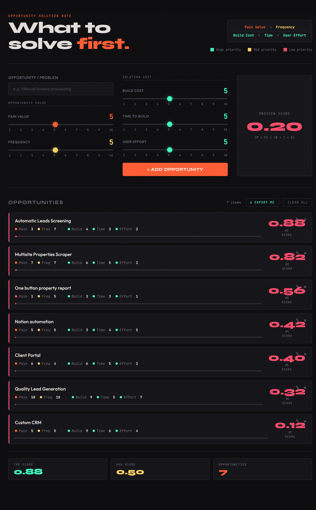

# OSR — Opportunity Solution Rate



A single-file tool for prioritizing product opportunities using a simple formula that balances the value of solving a problem against the cost of building the solution.

## Formula

```
Score = (Pain Value × Frequency) / (Build Cost × Time to Build × User Effort)
```

All inputs are rated 1–10. Scores range from **0.001** (lowest priority) to **100** (highest priority).

## Score Interpretation

| Score | Priority | Color |
|-------|----------|-------|
| > 5   | High     | Teal  |
| 1–5   | Medium   | Yellow |
| < 1   | Low      | Red   |

## Usage

No build step or server required — just open `index.html` in any browser.

### Adding an opportunity

1. Enter a name for the opportunity or problem in the text field.
2. Set the **Opportunity Value** sliders:
   - **Pain Value** — how much this problem hurts users (1 = minor inconvenience, 10 = critical blocker)
   - **Frequency** — how often users encounter this problem (1 = rare, 10 = constant)
3. Set the **Solution Cost** sliders:
   - **Build Cost** — engineering complexity and resources required (1 = trivial, 10 = massive)
   - **Time to Build** — calendar time to ship (1 = hours, 10 = months)
   - **User Effort** — effort users need to adopt the solution (1 = effortless, 10 = steep learning curve)
4. Watch the live **Preview Score** update in real time.
5. Click **+ Add Opportunity** (or press Enter) to save it.

Opportunities are automatically sorted by score, highest first.

### Editing and deleting

- Click the **✎** edit button on a card to load it back into the form. Adjust sliders and click **✓ Update Opportunity** to save.
- Click **×** to remove an opportunity.
- Click **Clear all** to wipe the entire list.

### Import / Export

- **↓ Export CSV** — downloads a `.csv` file with all opportunities and their input values.
- **↓ Export MD** — downloads a Markdown table suitable for documentation or sharing.
- **↑ Import CSV** — imports opportunities from a previously exported CSV file. Rows are merged into the existing list.

### Persistence

All data is saved automatically to `localStorage`. Your opportunities persist across browser sessions without any account or server.

## File Structure

```
index.html    — the entire app (HTML + CSS + JS, ~1 160 lines)
assets/
  favicon.svg — app icon
```
